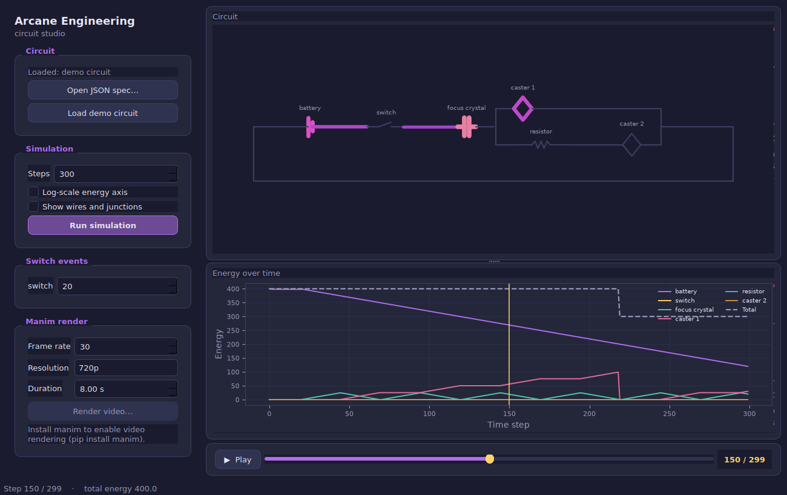

# Arcane Engineering

A desktop studio for **arcane circuits** — magical analogues of electrical
circuits where batteries store spell energy, wires and junctions route it, and
casters discharge it as spells. Build a circuit, watch energy flow through it
in an interactive preview, and export a [manim](https://docs.manim.community/)
animation for video.



The concept comes from
[GorillaOfDestiny](https://www.youtube.com/@GorillaOfDestiny)'s
[Arcane Engineering](https://www.drivethrurpg.com/en/product/495795/arcane-engineering)
D&D 5e supplement (part of the *Theory of Magic* project), which proposes
circuit components as an alternative to scrolls and spell slots. This project
simulates that idea numerically; it does not reproduce the book's rules. It is
a fork of the original prototype at
[GorillaOfDestiny/arcane-engineering](https://github.com/GorillaOfDestiny/arcane-engineering).

## Install

```bash
pip install -e .            # core + GUI (numpy, matplotlib, PySide6)
pip install -e ".[manim]"   # also install manim for video export
pip install -e ".[dev]"     # also install pytest
```

On Linux the Qt GUI needs system GL libraries (`libegl1 libgl1
libxkbcommon0` on Debian/Ubuntu).

## The studio

Launch the desktop app:

```bash
arcane-gui            # console entry point
# or: python -m arcane.gui
```

- **Circuit + energy side by side.** The schematic (top) and the
  energy-over-time graph (bottom) share one timeline.
- **Scrub the simulation.** The transport slider moves through the run: each
  component in the schematic brightens with its energy at that step, while a
  cursor tracks the same instant on the energy graph. Press play to sweep the
  whole run over the render duration.
- **Tune it.** Set the step count, log-scale the energy axis, show or hide the
  auto-inserted wires and junctions, and schedule when each switch flips on.
- **Export.** Pick a frame rate, resolution, and duration, then render an MP4
  through manim. The preview and the video use the same energy gradient, so
  what you scrub is what you get.

## Components

| Component | Circuit analogue | Behaviour |
|---|---|---|
| `Battery` | voltage source / spell slot | Stores energy for the circuit to drain. A level-0 battery needs no return path. |
| `Wire` | conductor | Pulls up to 1 energy/step from behind, dumps everything it holds forward. |
| `Resistor` | resistor | Throttles flow to 1/resistance energy per step. |
| `Concentration` | capacitor / focus crystal | Charges while releasing nothing; bursts downstream when full. `break_concentration()` dissipates whatever it holds (a failed concentration save). |
| `Junction` | node / splitter | Splits or merges parallel branches (one side must have exactly 1 port). Created automatically by `connect()`. |
| `Switch` | switch | Blocks flow until `toggle()`d on. |
| `AndGate` / `OrGate` | logic gates | Merge N inputs into 1 output; pass energy only while their boolean rule over the energised inputs holds. Place directly after a branch list. |
| `NotGate` | inverter | Emits from an internal reserve only while its input is quiet; the control signal that holds it shut is consumed. |
| `Caster` | load / wand | Accumulates energy and casts (drains to zero) at its threshold. |
| `Blank` | test point | Inert energy bucket, handy for probing. |

Every component carries a `level` (spell-level tier); `connect()` refuses to
wire components of different levels together.

## Scripting

The `arcane` package exposes the full model for use without the GUI:

```python
from arcane import connect, plot, simulate, plot_history
from arcane import Battery, Switch, Caster

battery = Battery(2, name="battery")
switch = Switch(2, name="switch")
casters = [Caster(2, name=f"caster {i}") for i in (1, 2, 3)]

circuit = connect([battery, switch, casters])   # nested lists are parallel branches
plot(circuit)                                    # schematic diagram

t, Es, ET = simulate(circuit, 600, events={50: switch.toggle})
plot_history(t, Es, ET)
```

Two branch lists may sit adjacent — their junctions link directly. A
multi-input gate placed right after a branch list becomes that list's closing
junction:

```python
circuit = connect([battery, [sensor_a, sensor_b], AndGate(2, level=2), caster])
```

## Circuits as JSON

Circuits can be described as JSON instead of Python (see
`examples/demo_circuit.json`). Objects with a `type` key become components;
arrays nest like `connect()` branch lists.

```bash
arcane-sim examples/demo_circuit.json --steps 200
```

```python
from arcane import load_circuit
circuit, registry = load_circuit("examples/demo_circuit.json")
```

## Rendering from code

```python
from arcane import connect, simulate, render_circuit
circuit = connect([...])
t, Es, ET = simulate(circuit, 300)
render_circuit(circuit, Es, "spell.mp4", fps=60, quality="1080p", run_time=10)
```

`quality` is one of `480p`, `720p`, `1080p`, `1440p`, `4k`. You can also render
the bundled demo from the CLI with `manim -pql arcane/manim_scene.py DemoScene`.

## Layout

```
arcane/
  components.py    circuit components and connect()/plot()
  simulation.py    stepping + energy-history helpers
  circuit_spec.py  JSON circuit specs
  layout.py        trace_layout(): reusable circuit geometry
  theme.py         shared palette + energy gradient
  manim_scene.py   circuit -> manim Scene
  render.py        render a Scene to a video (fps/quality control)
  gui/             the PySide6 desktop studio
tests/             pytest suite
examples/          sample JSON circuits
```

## Tests

```bash
python -m pytest        # GUI tests run headless via Qt's offscreen platform
```
